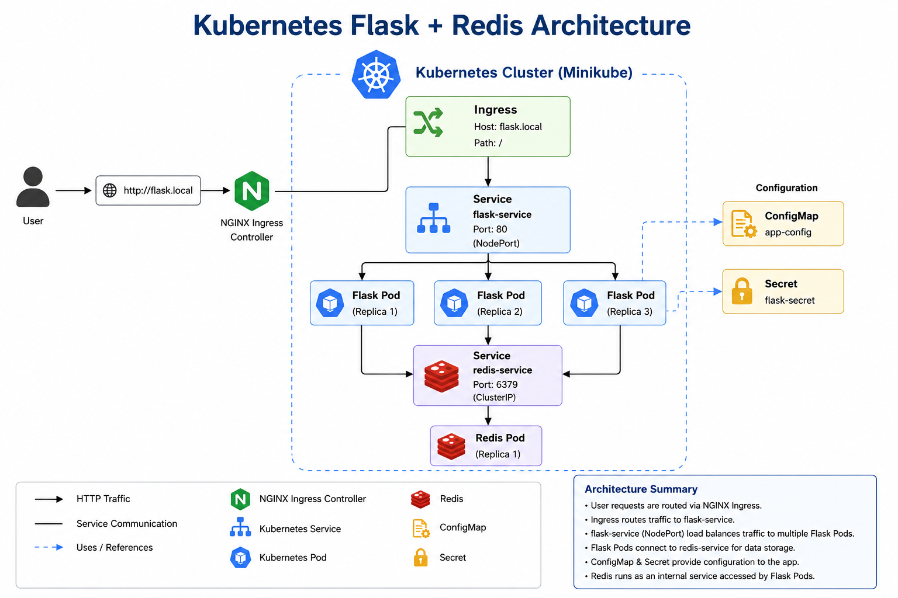
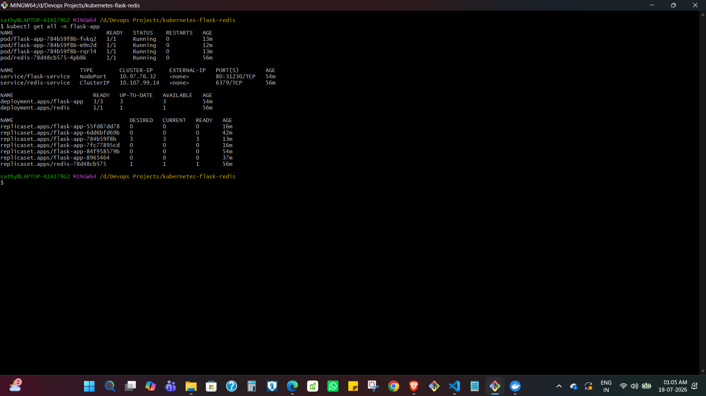
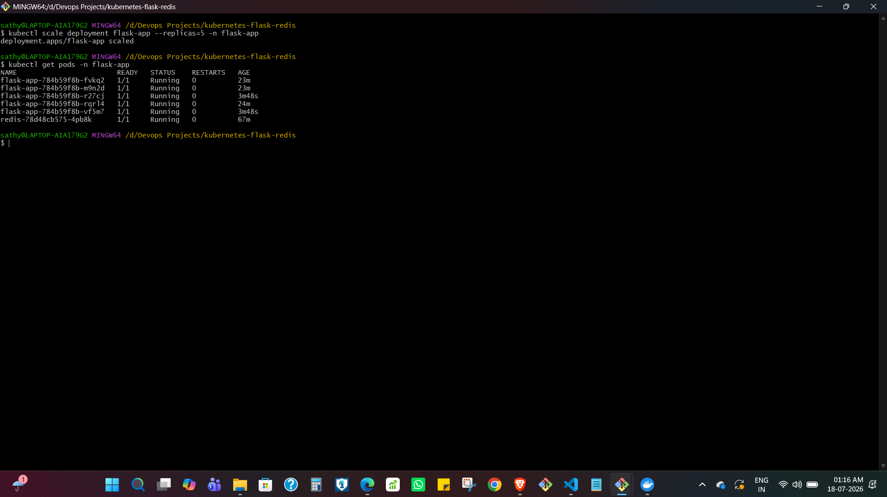
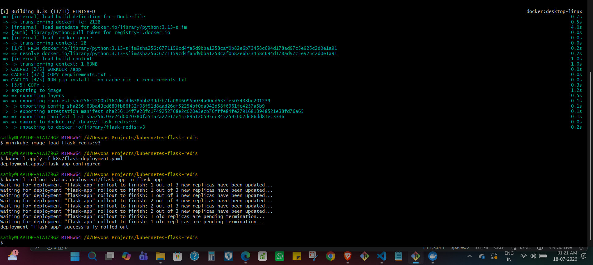
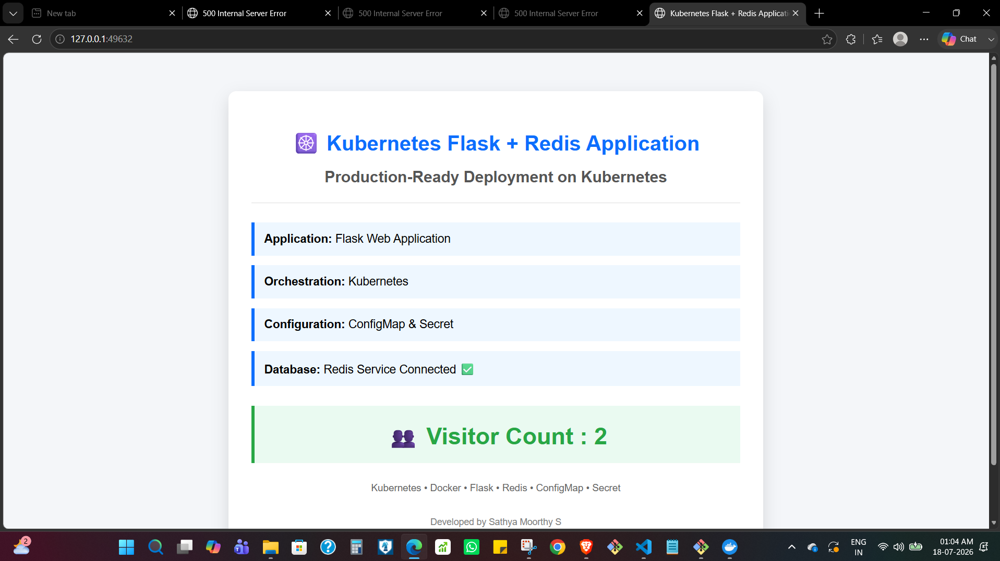
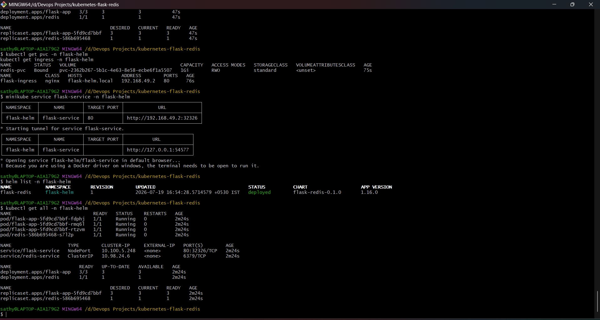

# Kubernetes Flask + Redis Application

> **TL;DR:** A Flask + Redis application deployed on a local Kubernetes cluster using both standard Kubernetes manifests and a Helm chart. The project implements service discovery, ConfigMap and Secret-based configuration, persistent storage, health probes, resource controls, manual scaling, rolling updates, and Ingress configuration. The Troubleshooting section documents service discovery and Ingress routing issues encountered during implementation.

## Overview

This project extends a Flask + Redis application originally developed with Docker Compose and deploys it to Kubernetes using Minikube.

The application consists of:

- **Flask** — serves the web application and maintains a visitor counter.
- **Redis** — stores the visitor count used by the Flask application.

Kubernetes manages Flask and Redis as separate workloads. The Flask application runs with multiple replicas behind a Kubernetes Service, while Redis is accessible internally through a ClusterIP Service.

Application configuration is externalized using a ConfigMap and Secret. Redis uses persistent storage through a PersistentVolumeClaim. The Flask containers also include liveness and readiness probes along with CPU and memory resource requests and limits.

The project supports two deployment workflows: standard Kubernetes manifests and a Helm chart. Both approaches deploy the same application architecture and were used to understand the difference between managing Kubernetes resources directly with `kubectl` and packaging them as a configurable Helm release.

## Architecture



The application runs as separate Flask and Redis workloads inside the Kubernetes cluster.

The main communication flow is:

1. Client traffic reaches the Flask application through `flask-service`.
2. The Service distributes traffic across the available Flask pods.
3. Flask connects to Redis through the internal `redis-service` DNS name.
4. Redis stores the application visitor count.
5. A PersistentVolumeClaim provides persistent storage for Redis.
6. Configuration values are supplied to the application through Kubernetes configuration resources.

An NGINX Ingress resource was also configured for host-based routing. In the local Windows and Minikube environment used for this project, application access was ultimately verified through the Minikube Service tunnel due to host-to-Minikube networking limitations.

## Key Features

- Flask and Redis deployed as separate Kubernetes workloads
- Multiple Flask replicas managed by a Deployment
- Internal Flask-to-Redis communication using Kubernetes service discovery
- ConfigMap-based application configuration
- Kubernetes Secret for environment configuration
- PersistentVolumeClaim for Redis storage
- Liveness and readiness probes
- CPU and memory resource requests and limits
- Manual application scaling
- Kubernetes rolling updates
- NGINX Ingress configuration
- Helm chart for configurable application deployment

## Technology Stack

| Technology | Role in the Project |
|---|---|
| Python | Application programming language |
| Flask | Web application framework |
| Redis | Visitor count data store |
| Docker | Application containerization |
| Kubernetes | Container orchestration |
| Minikube | Local Kubernetes cluster |
| kubectl | Kubernetes resource management |
| NGINX Ingress Controller | Host-based routing configuration |
| Helm | Kubernetes application packaging and deployment |
| YAML | Kubernetes manifests and Helm configuration |

## Project Structure

```text
kubernetes-flask-redis/
│
├── app/
│   ├── app.py
│   └── requirements.txt
├── Dockerfile
├── docker-compose.yml
├── README.md
│
├── k8s/
│   ├── namespace.yaml
│   ├── configmap.yaml
│   ├── secret.yaml
│   ├── flask-deployment.yaml
│   ├── flask-service.yaml
│   ├── redis-deployment.yaml
│   ├── redis-service.yaml
│   ├── pvc.yaml
│   ├── ingress.yaml
│   └── kustomization.yaml
│
├── helm/
│   └── flask-redis/
│       ├── Chart.yaml
│       ├── values.yaml
│       ├── .helmignore
│       ├── charts/
│       └── templates/
│           ├── configmap.yaml
│           ├── secret.yaml
│           ├── flask-deployment.yaml
│           ├── flask-service.yaml
│           ├── redis-deployment.yaml
│           ├── redis-service.yaml
│           ├── pvc.yaml
│           └── ingress.yaml
│
└── screenshots/
    ├── architecture-diagram.png
    ├── 01-project-structure.png
    ├── 02-homepage.png
    ├── 03-kubernetes-resources.png
    ├── 04-pods.png
    ├── 05-services.png
    ├── 06-deployments.png
    ├── 07-configmap.png
    ├── 08-secret.png
    ├── 09-scaling.png
    ├── 10-rolling-update.png
    ├── 11-ingress.png
    └── 12-helm-deployment.png
```

All implementation screenshots are retained in the repository, while this README displays only the screenshots that provide the most useful evidence of the deployment and Kubernetes workflows.

## Prerequisites

The following tools are required to run the project locally:

- Docker
- Kubernetes CLI (`kubectl`)
- Minikube
- Helm

Verify the installed tools:

```bash
docker --version
kubectl version --client
minikube version
helm version
```

Start the local Kubernetes cluster:

```bash
minikube start
```

Verify that the node is ready:

```bash
kubectl get nodes
```

## Build the Application Image

Build the Flask application image:

```bash
docker build -t flask-redis:v3 .
```

Load the locally built image into Minikube:

```bash
minikube image load flask-redis:v3
```

Verify that the image is available:

```bash
minikube image ls | grep flask-redis
```

## Application Configuration and Service Discovery

The Flask application reads the Redis connection details from environment variables:

```python
REDIS_HOST = os.getenv("REDIS_HOST", "redis-service")
REDIS_PORT = int(os.getenv("REDIS_PORT", 6379))
```

The connection configuration is supplied to the Flask containers through Kubernetes configuration resources.

Redis is exposed internally through:

```text
redis-service:6379
```

Flask connects to the Redis Service rather than directly addressing an individual Redis pod.

This provides a stable internal endpoint for the application. If the Redis pod is recreated, the Flask application continues to use the same Kubernetes Service name instead of depending on the IP address of a specific pod.

## Deployment with Kubernetes Manifests

The `k8s/` directory contains the Kubernetes resource definitions used to deploy the application.

Create the namespace:

```bash
kubectl apply -f k8s/namespace.yaml
```

Apply the application configuration:

```bash
kubectl apply -f k8s/configmap.yaml
kubectl apply -f k8s/secret.yaml
```

Deploy Redis and its persistent storage:

```bash
kubectl apply -f k8s/pvc.yaml
kubectl apply -f k8s/redis-deployment.yaml
kubectl apply -f k8s/redis-service.yaml
```

Deploy the Flask application:

```bash
kubectl apply -f k8s/flask-deployment.yaml
kubectl apply -f k8s/flask-service.yaml
```

Apply the Ingress configuration:

```bash
kubectl apply -f k8s/ingress.yaml
```

Verify the main resources:

```bash
kubectl get all -n flask-app
kubectl get pvc -n flask-app
kubectl get ingress -n flask-app
```



## Kubernetes Implementation Details

### Workloads and Services

The Flask application runs with multiple replicas managed by a Kubernetes Deployment. Redis runs as a separate workload.

Two Services provide network access:

- `flask-service` — exposes the Flask application.
- `redis-service` — provides an internal endpoint for Flask-to-Redis communication.

The Flask Service uses NodePort for access in the local Minikube environment.

The Redis Service uses ClusterIP because Redis only needs to be reachable from workloads inside the Kubernetes cluster.

### Configuration

Application configuration is separated from the container image using Kubernetes configuration resources.

The Redis connection settings include:

```text
REDIS_HOST=redis-service
REDIS_PORT=6379
```

Using external configuration allows connection settings to be changed without rebuilding the application image.

The project also includes a Kubernetes Secret for application environment configuration.

For a production environment, sensitive values should not be committed directly to a public repository. A dedicated secret management solution would be more appropriate.

### Health Checks

The Flask containers include liveness and readiness probes.

The **liveness probe** allows Kubernetes to identify an unhealthy container and restart it when required.

The **readiness probe** determines whether a pod is ready to receive traffic through the Kubernetes Service.

This separates container health from traffic readiness.

### Resource Management

CPU and memory requests and limits are configured for the Flask containers:

```yaml
resources:
  requests:
    cpu: "100m"
    memory: "128Mi"
  limits:
    cpu: "500m"
    memory: "512Mi"
```

Requests provide the Kubernetes scheduler with the expected resource requirements of the workload, while limits restrict the maximum resources the container can consume.

### Persistent Storage

Redis uses a PersistentVolumeClaim so that its data storage is separated from the lifecycle of the Redis container.

Verify the PVC with:

```bash
kubectl get pvc -n flask-app
```

In the local Minikube environment, the default StorageClass dynamically provisions the required persistent volume.

## Scaling

The Flask Deployment can be scaled by changing its desired replica count.

For example:

```bash
kubectl scale deployment flask-app --replicas=5 -n flask-app
```

Verify the additional pods:

```bash
kubectl get pods -n flask-app
```

Kubernetes creates additional Flask pods until the Deployment reaches the requested replica count.



This project demonstrates manual replica scaling. Automatic scaling through a Horizontal Pod Autoscaler is not implemented.

## Rolling Updates

The Flask Deployment uses the Kubernetes Deployment rollout mechanism when the application image is updated.

For example:

```bash
kubectl set image deployment/flask-app \
  flask=flask-redis:v3 \
  -n flask-app
```

Monitor the rollout:

```bash
kubectl rollout status deployment/flask-app -n flask-app
```

View rollout history:

```bash
kubectl rollout history deployment/flask-app -n flask-app
```



This demonstrates how Kubernetes can gradually replace application pods through the Deployment controller rather than manually deleting and recreating the entire workload.

## Ingress

NGINX Ingress was configured to provide host-based routing to the Flask Service.

Enable the Minikube Ingress addon:

```bash
minikube addons enable ingress
```

Apply and verify the Ingress:

```bash
kubectl apply -f k8s/ingress.yaml
kubectl get ingress -n flask-app
```

The Kubernetes manifest deployment uses:

```text
flask.local
```

The Ingress controller and Ingress resource were configured and the backend application resources were verified. However, end-to-end browser access through `flask.local` was not achievable from the Windows host in this local Docker-driver Minikube environment due to host-to-Minikube networking limitations.

Application access was therefore verified using the Minikube Service tunnel:

```bash
minikube service flask-service -n flask-app
```

The Ingress configuration is included as part of the Kubernetes implementation, but direct host-based browser access should be considered a local environment limitation rather than a fully verified end-to-end Ingress path.

## Accessing the Application

Access the application through the Flask Service:

```bash
minikube service flask-service -n flask-app
```

When using the Docker driver on Windows, Minikube provides a local tunnel to the Service.

The application displays the visitor count stored in Redis.



## Deployment with Helm

The project also includes a Helm chart located at:

```text
helm/flask-redis/
```

The chart packages the Kubernetes resources required by the Flask and Redis application.

Configurable deployment values are centralized in:

```text
helm/flask-redis/values.yaml
```

This allows settings such as replica count, container image, resources, Redis configuration, persistent storage, and Ingress hostname to be configured without directly editing each Kubernetes template.

Validate the chart:

```bash
helm lint ./helm/flask-redis
```

Render the generated manifests before installation:

```bash
helm template flask-redis ./helm/flask-redis
```

Install the Helm release:

```bash
helm install flask-redis ./helm/flask-redis \
  --namespace flask-helm \
  --create-namespace
```

Verify the release and deployed resources:

```bash
helm list -n flask-helm
kubectl get all -n flask-helm
kubectl get pvc -n flask-helm
kubectl get ingress -n flask-helm
```



## Kubernetes Manifests vs Helm

The project contains two deployment approaches for the same application.

### Standard Kubernetes Manifests

The `k8s/` directory contains individual Kubernetes resource definitions that can be applied directly using `kubectl`.

This approach was used to work directly with the individual Kubernetes objects and understand how the application components are configured and connected.

### Helm Chart

The `helm/flask-redis/` directory packages the same application architecture as a Helm chart.

Helm templates the Kubernetes resources and centralizes configurable settings in `values.yaml`, making the deployment easier to configure and reuse.

During project testing, both versions were temporarily kept running in separate namespaces:

```text
flask-app     Standard Kubernetes manifest deployment
flask-helm    Helm-managed deployment
```

Keeping both deployments active simultaneously was a deliberate testing choice to compare the `kubectl`-based and Helm-based workflows side by side and verify that both deployment methods produced working Kubernetes resources.

This is not intended as a recommended production deployment pattern. In a normal environment, one deployment method would typically be selected, with Helm managing the application's Kubernetes resources when the chart-based workflow is used.

## Verification

The project was verified using Kubernetes and Helm commands at different stages of implementation.

Key verification commands include:

```bash
# Verify Kubernetes workloads
kubectl get all -n flask-app

# Verify application pods
kubectl get pods -n flask-app

# Verify persistent storage
kubectl get pvc -n flask-app

# Inspect application logs
kubectl logs -l app=flask -n flask-app

# Verify rollout status
kubectl rollout status deployment/flask-app -n flask-app

# Verify the Helm release
helm list -n flask-helm

# Verify Helm-managed resources
kubectl get all -n flask-helm
```

The implementation was verified for:

- Successful Flask and Redis pod deployment
- Flask-to-Redis communication through Kubernetes service discovery
- Multiple Flask replicas
- Application access through the Flask Service
- PersistentVolumeClaim creation
- Liveness and readiness probe configuration
- Resource request and limit configuration
- Manual replica scaling
- Deployment rolling updates
- Helm chart validation and installation

Ingress resources and the NGINX Ingress controller were configured and verified at the Kubernetes resource level, but direct host-based browser access was limited by the local Windows and Minikube networking environment as described in the Ingress section.

## Troubleshooting

Two technical issues encountered during the project required investigation beyond the initial resource deployment.

### Flask-to-Redis Service Discovery

After the application was initially deployed to Kubernetes, the Flask application returned HTTP 500 errors.

Application logs were inspected using:

```bash
kubectl logs -l app=flask -n flask-app
```

The logs showed that Flask was attempting to connect to:

```text
redis:6379
```

and failing with a hostname resolution error.

The application had originally been developed with Docker Compose, where `redis` was the Compose service name. In Kubernetes, Redis was exposed through a Service named `redis-service`, so the original Docker Compose hostname was no longer valid.

The application was updated to read the Redis hostname and port from environment variables:

```python
REDIS_HOST = os.getenv("REDIS_HOST", "redis-service")
REDIS_PORT = int(os.getenv("REDIS_PORT", 6379))
```

The Kubernetes configuration then supplied the correct Service hostname.

This removed the application's dependency on the Docker Compose service name and allowed Flask to connect to Redis through Kubernetes service discovery.

### Helm Ingress Host Conflict

The Helm deployment was installed in a separate namespace while the standard Kubernetes deployment was still running for side-by-side testing.

The Helm installation encountered an Ingress conflict because both deployments attempted to define the same host and path:

```text
flask.local/
```

Although the application deployments existed in separate namespaces, the NGINX Ingress controller still detected the duplicate routing rule.

The Helm configuration was changed to use:

```text
flask-helm.local
```

This allowed the two test deployments to coexist while their deployment workflows were being compared.

The separate hostname was required only because both versions were intentionally kept active at the same time for testing. It is not necessary when using a single deployment method.

## Selected Project Evidence

The following screenshots highlight the main implementation and verification points.

### Kubernetes Resources


Shows the core application resources deployed in the Kubernetes namespace.

### Application Scaling


Shows the Flask Deployment scaled to additional replicas.

### Rolling Update


Shows the application Deployment during the rollout workflow.

### Application Access


Shows the Flask application running with the Redis-backed visitor counter.

### Helm Deployment


Shows the application resources deployed through the Helm chart.

The remaining screenshots are retained in the `screenshots/` directory as additional project evidence without being displayed individually in the README.

## Cleanup

Remove the standard Kubernetes deployment:

```bash
kubectl delete namespace flask-app
```

Remove the Helm release and namespace:

```bash
helm uninstall flask-redis -n flask-helm
kubectl delete namespace flask-helm
```

Stop Minikube:

```bash
minikube stop
```

To completely remove the local cluster:

```bash
minikube delete
```

## Future Improvements

The current project focuses on Kubernetes deployment and orchestration in a local Minikube environment.

Relevant next steps would be:

- Replace the Flask development server with a production WSGI server such as Gunicorn.
- Store versioned application images in a container registry.
- Add CI/CD automation for image builds and Helm deployments.
- Deploy the application to a managed Kubernetes environment such as Amazon EKS.
- Introduce production-oriented secret management, monitoring, and TLS if the application is moved beyond the local learning environment.