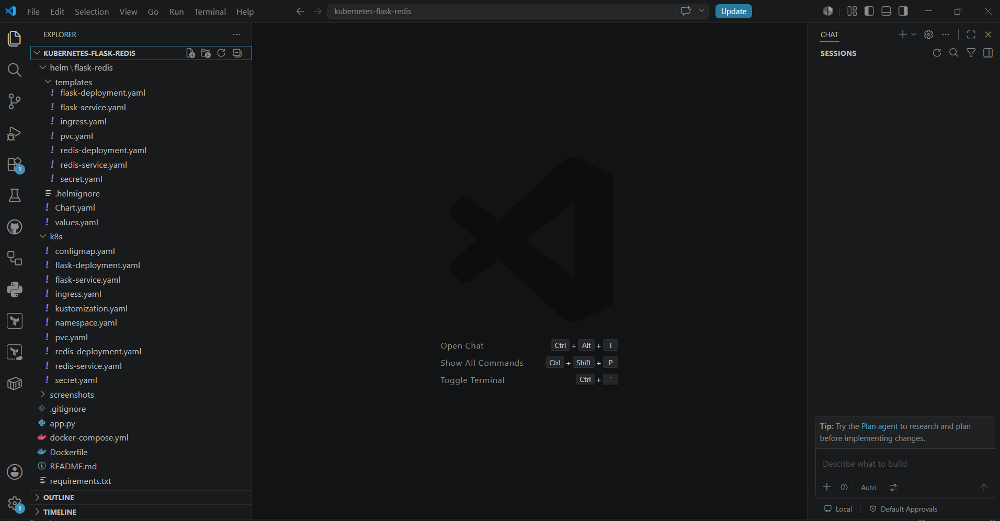
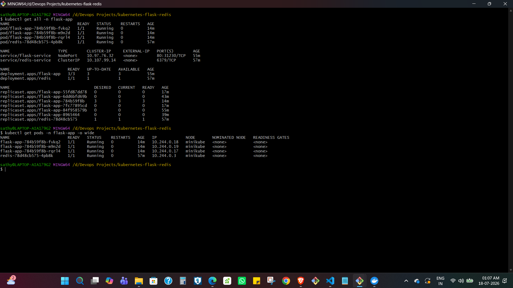
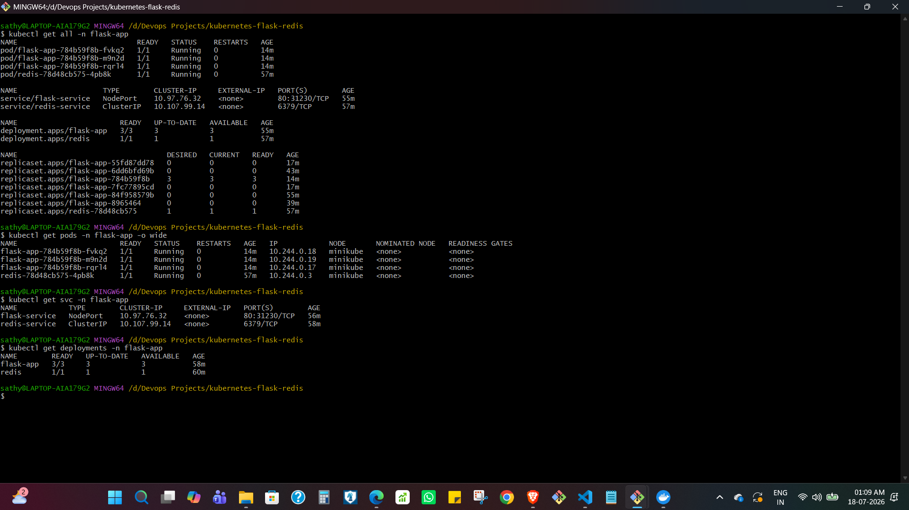
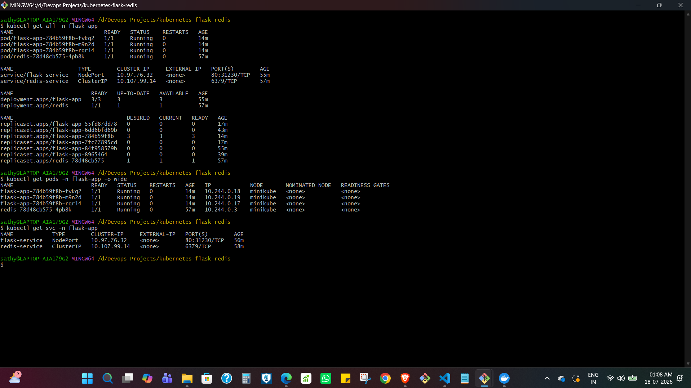
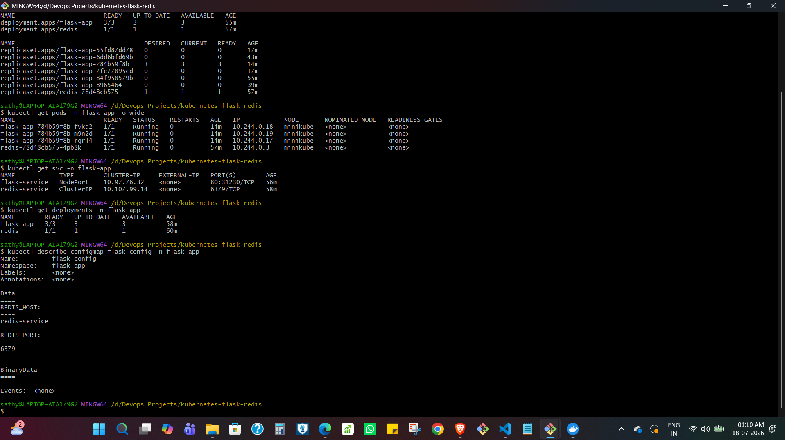
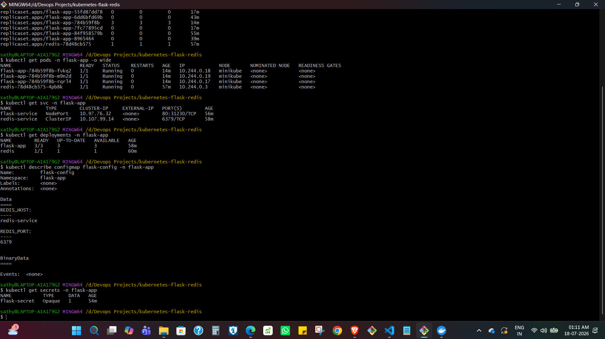
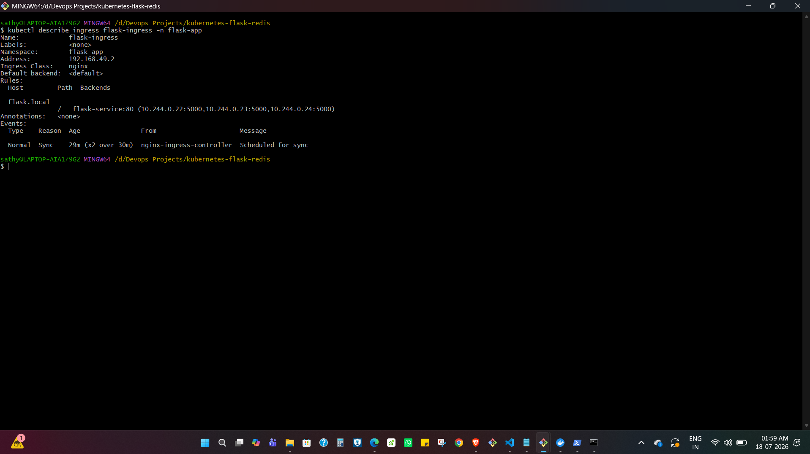

# Kubernetes Flask + Redis Application

A containerized Flask and Redis application deployed on Kubernetes using Minikube. This project demonstrates Kubernetes workload management, service discovery, configuration management, persistent storage, health checks, resource management, scaling, rolling updates, Ingress, and Helm-based deployment.

The application was originally developed as a multi-container Docker Compose application and was extended to run on Kubernetes. It can be deployed using standard Kubernetes manifests or through a reusable Helm chart.

---

## Overview

The application consists of two main components:

- **Flask** - Serves the web application and maintains a visitor counter.
- **Redis** - Stores the visitor count used by the Flask application.

Kubernetes manages Flask and Redis as separate workloads. The Flask application runs with multiple replicas behind a Kubernetes Service, while Redis is exposed internally through a ClusterIP Service.

Application configuration is externalized using a ConfigMap and Secret. Redis uses persistent storage through a PersistentVolumeClaim. Liveness and readiness probes are configured for container health checks, along with CPU and memory resource requests and limits.

The project also includes a Helm chart that packages the Kubernetes resources into a reusable and configurable deployment.

---

## Architecture

The application runs inside a Kubernetes cluster with Flask and Redis deployed as separate workloads.

Traffic is routed to the Flask application through a Kubernetes Service, while the Flask pods communicate with Redis using the internal Redis Service. Redis uses a PersistentVolumeClaim for persistent data storage.

An NGINX Ingress configuration provides host-based routing, and the Helm chart provides an alternative method for packaging and deploying the complete application stack.


---

## Features

- Flask and Redis multi-container application
- Kubernetes Deployments for Flask and Redis
- Multiple Flask replicas
- Kubernetes Services for application and Redis communication
- ConfigMap-based application configuration
- Kubernetes Secret for environment configuration
- Persistent storage for Redis
- Liveness and readiness probes
- CPU and memory resource requests and limits
- Application scaling
- Rolling updates
- NGINX Ingress configuration
- Helm chart for reusable application deployment
- Separate raw Kubernetes and Helm deployment methods

---

## Technology Stack

| Technology | Purpose |
|---|---|
| Python | Application programming language |
| Flask | Web application framework |
| Redis | Visitor count data store |
| Docker | Application containerization |
| Kubernetes | Container orchestration |
| Minikube | Local Kubernetes cluster |
| kubectl | Kubernetes command-line management |
| NGINX Ingress Controller | Host-based application routing |
| Helm | Kubernetes application packaging and deployment |
| YAML | Kubernetes and Helm configuration |

---

## Project Structure

```text
kubernetes-flask-redis/
│
├── app.py
├── Dockerfile
├── docker-compose.yml
├── requirements.txt
├── README.md
│
├── k8s/
│   ├── namespace.yaml
│   ├── configmap.yaml
│   ├── secret.yaml
│   ├── flask-deployment.yaml
│   ├── flask-service.yaml
│   ├── redis-deployment.yaml
│   ├── redis-service.yaml
│   ├── pvc.yaml
│   ├── ingress.yaml
│   └── kustomization.yaml
│
├── helm/
│   └── flask-redis/
│       ├── Chart.yaml
│       ├── values.yaml
│       ├── .helmignore
│       ├── charts/
│       └── templates/
│           ├── configmap.yaml
│           ├── secret.yaml
│           ├── flask-deployment.yaml
│           ├── flask-service.yaml
│           ├── redis-deployment.yaml
│           ├── redis-service.yaml
│           ├── pvc.yaml
│           └── ingress.yaml
│
└── screenshots/
    ├── architecture-diagram.png
    ├── 01-project-structure.png
    ├── 02-homepage.png
    ├── 03-kubernetes-resources.png
    ├── 04-pods.png
    ├── 05-services.png
    ├── 06-deployments.png
    ├── 07-configmap.png
    ├── 08-secret.png
    ├── 09-scaling.png
    ├── 10-rolling-update.png
    ├── 11-ingress.png
    └── 12-helm-deployment.png
```



---

## Prerequisites

The following tools are required to run the project locally:

- Docker
- Kubernetes CLI (`kubectl`)
- Minikube
- Helm

Verify the installed tools:

```bash
docker --version
kubectl version --client
minikube version
helm version
```

Start the local Kubernetes cluster:

```bash
minikube start
```

Verify the cluster:

```bash
kubectl get nodes
```

The Minikube node should report a `Ready` status before deploying the application.

---

## Build the Application Image

Build the Flask application image:

```bash
docker build -t flask-redis:v3 .
```

Load the locally built image into Minikube:

```bash
minikube image load flask-redis:v3
```

Verify that the image is available:

```bash
minikube image ls | grep flask-redis
```

---

## Application Configuration

The Flask application reads the Redis connection details from environment variables:

```python
REDIS_HOST = os.getenv("REDIS_HOST", "redis-service")
REDIS_PORT = int(os.getenv("REDIS_PORT", 6379))
```

The values are supplied to the Flask containers using a Kubernetes ConfigMap.

Redis is exposed internally through the Kubernetes Service:

```text
redis-service:6379
```

The Flask pods connect to the Redis Service rather than directly addressing a Redis pod. This allows Kubernetes service discovery to provide a stable endpoint even if the Redis pod is recreated.

---

## Deployment with Kubernetes

The `k8s/` directory contains the standard Kubernetes manifests for deploying the application.

Create the namespace:

```bash
kubectl apply -f k8s/namespace.yaml
```

Apply the ConfigMap and Secret:

```bash
kubectl apply -f k8s/configmap.yaml
kubectl apply -f k8s/secret.yaml
```

Deploy Redis and persistent storage:

```bash
kubectl apply -f k8s/pvc.yaml
kubectl apply -f k8s/redis-deployment.yaml
kubectl apply -f k8s/redis-service.yaml
```

Deploy the Flask application:

```bash
kubectl apply -f k8s/flask-deployment.yaml
kubectl apply -f k8s/flask-service.yaml
```

Apply the Ingress configuration:

```bash
kubectl apply -f k8s/ingress.yaml
```

Verify the deployed resources:

```bash
kubectl get all -n flask-app
```


---

## Pods and Deployments

The Flask application runs with three replicas, while Redis runs as a single instance.

Check the pods:

```bash
kubectl get pods -n flask-app
```



Check the Deployments:

```bash
kubectl get deployments -n flask-app
```

The Flask Deployment maintains the desired number of application replicas, while the Redis Deployment manages the Redis workload.



---

## Services

The application uses two Kubernetes Services:

- `flask-service` - Exposes the Flask application.
- `redis-service` - Provides internal access to Redis.

Check the Services:

```bash
kubectl get svc -n flask-app
```

The Flask Service uses NodePort for local access. The Redis Service uses ClusterIP because Redis only needs to be accessible from workloads inside the cluster.



---

## ConfigMap and Secret

Application configuration is separated from the container image using Kubernetes ConfigMaps and Secrets.

The ConfigMap stores the Redis connection configuration:

```text
REDIS_HOST=redis-service
REDIS_PORT=6379
```

View the ConfigMap:

```bash
kubectl get configmap flask-config -n flask-app
```



The application environment configuration is provided through a Kubernetes Secret.

View the Secret metadata:

```bash
kubectl get secret flask-secret -n flask-app
```



For a production environment, sensitive values should not be stored directly in a public repository. A dedicated secret management solution should be used instead.

---

## Health Checks and Resource Management

The Flask containers include liveness and readiness probes.

The **liveness probe** allows Kubernetes to detect when a container is unhealthy and restart it when necessary.

The **readiness probe** determines when a pod is ready to receive traffic through the Kubernetes Service.

Resource requests and limits are also configured for the Flask containers:

```yaml
resources:
  requests:
    cpu: "100m"
    memory: "128Mi"
  limits:
    cpu: "500m"
    memory: "512Mi"
```

Resource requests provide Kubernetes with information for workload scheduling, while resource limits restrict the maximum resources a container can consume.

---

## Persistent Storage

Redis uses a PersistentVolumeClaim to provide persistent storage.

Check the PVC:

```bash
kubectl get pvc -n flask-app
```

The PersistentVolumeClaim separates Redis data from the lifecycle of the Redis container.

In the local Minikube environment, the default StorageClass dynamically provisions the required storage.

---

## Scaling

The Flask Deployment can be scaled by changing the desired replica count.

For example:

```bash
kubectl scale deployment flask-app --replicas=5 -n flask-app
```

Verify the new replica count:

```bash
kubectl get pods -n flask-app
```

Kubernetes creates additional Flask pods until the desired state is reached.


---

## Rolling Updates

Kubernetes Deployments support rolling updates, allowing application versions to be updated while gradually replacing existing pods.

Update the Flask container image:

```bash
kubectl set image deployment/flask-app \
  flask=flask-redis:v3 \
  -n flask-app
```

Monitor the rollout:

```bash
kubectl rollout status deployment/flask-app -n flask-app
```

View the rollout history:

```bash
kubectl rollout history deployment/flask-app -n flask-app
```


---

## Ingress

NGINX Ingress is configured to provide host-based routing to the Flask Service.

Enable the Minikube Ingress addon:

```bash
minikube addons enable ingress
```

Verify the Ingress controller:

```bash
kubectl get pods -n ingress-nginx
```

Apply the Ingress resource:

```bash
kubectl apply -f k8s/ingress.yaml
```

Check the Ingress:

```bash
kubectl get ingress -n flask-app
```

The Kubernetes deployment uses the hostname:

```text
flask.local
```

The local Windows hosts file was configured to map `flask.local` to the Minikube IP.

In this setup, Minikube was running with the Docker driver on Windows. Although the Ingress controller, Ingress resource, backend Service, and application endpoints were verified, direct access to the Minikube IP from the Windows host was limited by the local networking environment.

The application was therefore accessed and verified using the Minikube Service tunnel.



---

## Accessing the Application

Access the application through the Flask Service:

```bash
minikube service flask-service -n flask-app
```

When using the Docker driver on Windows, Minikube creates a local tunnel to the Kubernetes Service.

The application displays the current visitor count stored in Redis.


---

## Deployment with Helm

In addition to the standard Kubernetes manifests, the project includes a Helm chart located at:

```text
helm/flask-redis/
```

The chart packages the Flask Deployment, Redis Deployment, Services, ConfigMap, Secret, PersistentVolumeClaim, health probes, resource configuration, and Ingress.

Deployment settings are centralized in:

```text
helm/flask-redis/values.yaml
```

This allows settings such as replica count, container image, resource limits, Redis configuration, persistent storage, and Ingress hostname to be changed without modifying the Kubernetes templates directly.

### Validate the Chart

Run Helm linting:

```bash
helm lint ./helm/flask-redis
```

Render the generated Kubernetes manifests before installation:

```bash
helm template flask-redis ./helm/flask-redis
```

### Install the Chart

The Helm version of the application can be deployed into a separate namespace:

```bash
helm install flask-redis ./helm/flask-redis \
  --namespace flask-helm \
  --create-namespace
```

Verify the Helm release:

```bash
helm list -n flask-helm
```

Verify the Kubernetes resources created by Helm:

```bash
kubectl get all -n flask-helm
```

Check persistent storage and Ingress:

```bash
kubectl get pvc -n flask-helm
kubectl get ingress -n flask-helm
```

The Helm deployment uses a separate Ingress hostname:

```text
flask-helm.local
```

Access the Helm-managed application:

```bash
minikube service flask-service -n flask-helm
```


---

## Kubernetes Manifests vs Helm

The project supports two deployment approaches.

### Standard Kubernetes Manifests

The `k8s/` directory contains individual Kubernetes resource definitions that can be applied directly using `kubectl`.

This approach makes each Kubernetes object explicit and provides direct control over the individual manifests.

### Helm Chart

The `helm/flask-redis/` directory packages the same application architecture as a Helm chart.

Helm templates the Kubernetes resources and centralizes configurable values in `values.yaml`, making the deployment easier to reuse and customize.

During testing, the two deployments were kept separate:

```text
flask-app     Kubernetes manifests
flask-helm    Helm-managed deployment
```

---

## Troubleshooting

Two issues encountered during the project required investigation beyond basic deployment configuration.

### Flask-to-Redis Service Discovery

The application initially returned HTTP 500 errors after being deployed to Kubernetes.

Application logs were checked using:

```bash
kubectl logs -l app=flask -n flask-app
```

The logs showed that Flask was unable to resolve the Redis hostname:

```text
Error -3 connecting to redis:6379.
Temporary failure in name resolution.
```

The application had originally been developed using Docker Compose, where `redis` was the Compose service name. In Kubernetes, Redis was exposed through a Service named `redis-service`, so the original hostname was no longer valid.

The application was updated to read the Redis hostname and port from environment variables:

```python
REDIS_HOST = os.getenv("REDIS_HOST", "redis-service")
REDIS_PORT = int(os.getenv("REDIS_PORT", 6379))
```

The values were supplied through a Kubernetes ConfigMap.

This removed the hardcoded dependency on the Docker Compose service name and allowed the application to use Kubernetes service discovery.

### Helm Ingress Host Conflict

The first Helm deployment was installed into a separate namespace so that it could run alongside the deployment created using standard Kubernetes manifests.

The installation was rejected by the NGINX Ingress admission webhook because both deployments attempted to define the same host and path combination:

```text
flask.local/
```

Although the deployments were in different namespaces, the Ingress controller still detected the duplicate routing rule.

The Helm configuration was updated to use a separate hostname:

```text
flask-helm.local
```

This allowed both deployments to coexist:

```text
Kubernetes manifests    flask-app namespace     flask.local
Helm chart              flask-helm namespace    flask-helm.local
```

---

## Cleanup

Remove the deployment created using standard Kubernetes manifests:

```bash
kubectl delete namespace flask-app
```

Remove the Helm release:

```bash
helm uninstall flask-redis -n flask-helm
```

Remove the Helm namespace:

```bash
kubectl delete namespace flask-helm
```

Stop Minikube:

```bash
minikube stop
```

To completely remove the local Minikube cluster:

```bash
minikube delete
```

---

## Future Improvements

The current project runs on a local Minikube cluster and focuses on Kubernetes deployment and orchestration concepts.

Possible next steps include:

- Replace the Flask development server with a production WSGI server such as Gunicorn.
- Store container images in a container registry.
- Deploy the application to a managed Kubernetes service such as Amazon EKS.
- Add CI/CD for automated image builds and Helm deployments.
- Integrate a dedicated secret management solution.
- Add monitoring with Prometheus and Grafana.
- Configure TLS for HTTPS Ingress traffic.